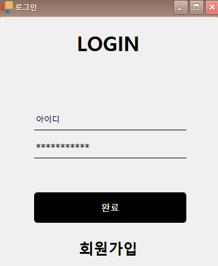
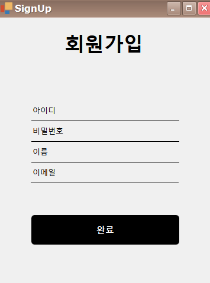
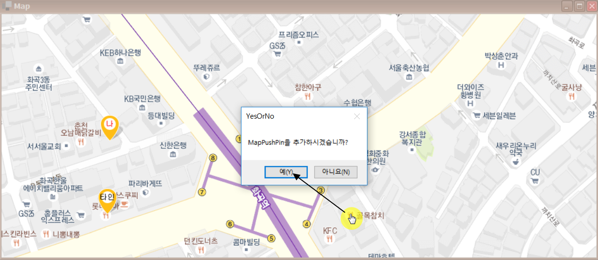
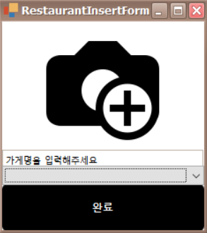
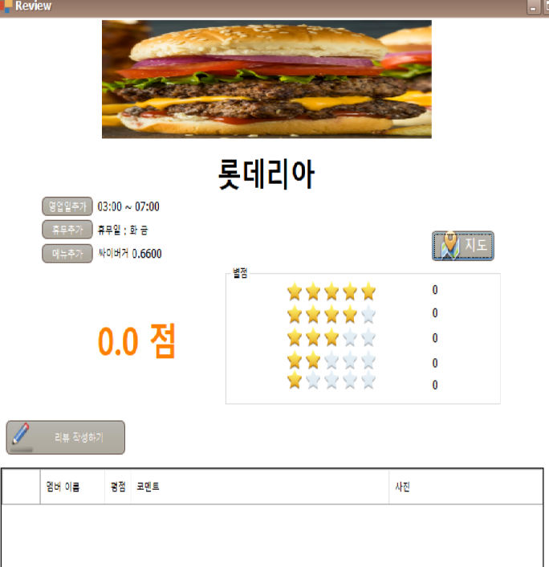
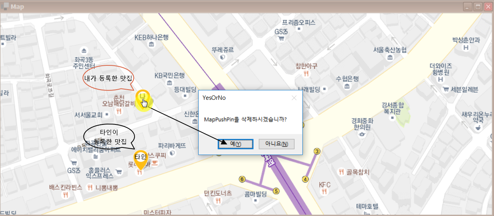
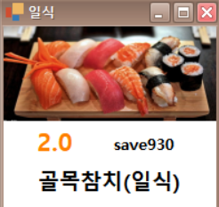

# 개관 

 MatZip은 Microsoft사에서 제공하는 Bing Maps API를 활용하여 나만의 맛집리스트들을 
저장하고 다른 사람들과 의견을 공유할 수 있는 프로그램입니다.

## 데이터베이스 설계

## 설명
#### 1. 로그인

회원가입이 된 아이디와 비밀번호를 입력하고 아직 생성하지 않았다면, 회원가입 버튼을 클릭합니다.

#### 2. 회원가입

생성할 아이디, 비밀번호, 이름, 이메일 순으로 입력 후 회원가입 버튼을 클릭합니다.

#### 3. 지도
**참고: 마우스 휠을 위로 올리면 ZoomIn이 되고, 아래로 내리면 ZoomOut이 됩니다.

##### 맛집 등록(필수 입력사항 / 선택입력사항)

###### 1) 등록할 지점선택

마우스 휠을 이용하여 적절히 ZoomIn, ZoomOut을 한 다음 맛집으로 등록할 곳에 마우스 커서를
올리고 Double Click을 합니다. 
"추가하시겠습니까?"라는 MessagaBox가 뜨고 추가하려면 'Yes' or 'No'중에서 Yes를 누릅니다.

###### 2) 가게명과 음식의 종류 기재 (필수 입력)

사진아이콘을 클릭하면 해당 음식점과 관련된 이미지를 업로드 할 수 있습니다.
**이미지 업로드 하지 않을 시, 기본 이미지가 삽입됩니다.
상호명을 입력합니다.
음식 종류를 선택합니다. (한식 / 중식 / 일식 / 양식)

###### 3) 영업시간, 휴무일, 메뉴이름, 가격 기입 (선택 입력)

이 부분은 유저가 선택해서 입력하는 부분입니다.
가장 아래의 리뷰작성하기 부분에서 유저들간의 의견 교류가 가능합니다.

##### 맛집 삭제

마우스 휠을 이용하여 적절히 ZoomIn, ZoomOut을 한 다음 내가 등록한 맛집을 삭제할 곳에 마우스를 클릭하면
"삭제하시겠습니까?"라는 MessagaBox가 뜨고 삭제하려면 'Yes' or 'No'중에서 Yes를 누릅니다.

##### 맛집 정보 간략히 보기

마우스 휠을 이용하여 적절히 ZoomIn, ZoomOut을 한 다음 맛집으로 등록된 지점에 마우스를 올려두면
맛집의 정보를 간략화(썸네일 형식)하여 보여줍니다. 

##### 어려웠던 점
1. 처음에 MapPushPin을 추가할 때 단지 Map Control에 item을 추가하면 되는 줄 알았는데 아니었습니다.
이를 해결한 방법은 Map Control에 VectorItemsLayer를 추가 후 MapItemStorage를 이용해서 MapPushPin을 Map에 추가했습니다.

2. Form에서 다른 Form으로 캡슐화를 지키면서 어떻게 데이터를 교환할지 고민했습니다.
이를 해결한 방법은 Interface를 구현해서 Form에서 다른 Form으로 객체를 전달해줬습니다.

3. MapPushPin을 전체 맵에서 어떻게 인식해야 할지 고민을 했습니다.
처음에는 MapItemClick 이벤트를 이용해 MapItemStorage에 저장된 모든 MapPushPin의 좌표를 탐색해서 찾았습니다.
저희의 목표는 MouseMove 이벤트로 Map Push Pin에 마우스 커서만 올려도 새로운 폼을 띄우고 싶었습니다.
이를 해결한 방법은 MapHitInfo 클래스를 이용해서 마우스 커서가 MapPushPin을 인식할 수 있었습니다.

4. 리뷰에 사진을 올릴 때 어려움을 겪었습니다.
dataGrideView에 사진을 올릴 때 DB에는 이미지의 파일 경로만 저장되어 있기 때문에 어떻게 이미지를 올려야 할지 고민했습니다.
이를 해결하기 위해 DataGridViewImageColumn 클래스를 이용했습니다.

##### 느낀점

이전까지는 Git과 같은 VersionControl을 이용하지 않고 일일이 프로젝트를 알집으로 압축 후, 이어붙이는 형식으로
프로젝트를 진행하였지만, Git을 쓰고 공동 작업이 훨씬 수월해지는 것을 느낄 수 있었습니다.

 

