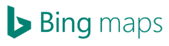

# 개관 

 MatZip은 Microsoft사에서 제공하는 Bing Maps API를 활용하여 나만의 맛집리스트들을 
저장하고 다른사람들과 의견을 공유할 수 있는 프로그램입니다.

## 설명
#### 1. 로그인

회원가입이 된 아이디와 비밀번호를 입력하고 아직 생성하지 않았다면, 회원가입 버튼을 클릭합니다.

#### 2. 회원가입

생성할 아이디, 비밀번호, 이름, 이메일 순으로 입력 후 회원가입 버튼을 클릭합니다.

#### 3. 맵
"나"와 "다른사람"이 등록한 핀이 다른 화면을 캡쳐해서 넣어주자.

##### 맛집 등록 기능
**참고: 마우스 휠을 위로 올리면 ZoomIn이 되고, 아래로 내리면 ZoomOut이 됩니다.
마우스 휠을 이용하여 적절히 ZoomIn, ZoomOut을 한 다음 맛집으로 등록할 곳에 마우스커서를
올리고 Double Click을 합니다. 
"추가하시겠습니까?"라는 MessagaBox가 뜨고 추가하시려면 'Yes' or 'No'중에서 Yes를 누릅니다.

##### 맛집 삭제 기능
**참고: 마우스 휠을 위로 올리면 ZoomIn이 되고, 아래로 내리면 ZoomOut이 됩니다.
마우스 휠을 이용하여 적절히 ZoomIn, ZoomOut을 한 다음 내가 등록한 맛집을 삭제할 곳에 마우스를 클릭하면
"삭제하시겠습니까?"라는 MessagaBox가 뜨고 삭제하시려면 'Yes' or 'No'중에서 Yes를 누릅니다.

##### 맛집 보기 기능
**참고: 마우스 휠을 위로 올리면 ZoomIn이 되고, 아래로 내리면 ZoomOut이 됩니다.
마우스 휠을 이용하여 적절히 ZoomIn, ZoomOut을 한 다음 맛집으로 등록된 지점에 마우스를 올려두면
맛집의 정보를 간략화(썸네일 형식)하여 보여줍니다.

#### 4. 썸네일

#####맨아래 프로젝트를 진행하면서 어려웠던 점 5가지정도 적기.

 

